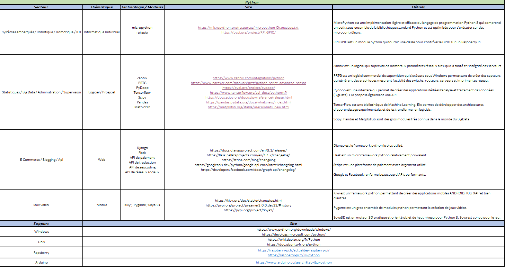
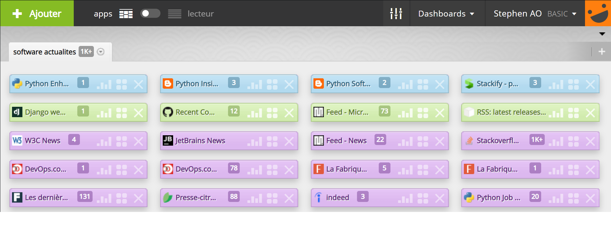

# P12_construisez_une_veille_technologique  
Un développeur doit rester constamment à l'affût des nouveautés technologiques, qui évoluent en continu.  
La veille technologique est pour cela une étape indispensable au quotidien.  

  

Les bons développeurs suivent régulièrement les nouveautés du secteur.  

# Description
En tant que développeur PYTHON FULLSTACK, je souhaite couvrir une certaine plage de compétences.  
De la conception au déploiement, du web au mobile, plusieurs secteurs m'intéressent.  
Cependant, ils sont classés par ordre d'appréciation :  

    - Les systèmes embarqués
    - Les APIs, Le blogging
    - Les Jeux vidéos
    - Les BigData, Le Monitoring

# Tableau de bord Physique - Excel
Le tableau ci-dessous détaille les points d'intérêts ciblés par ma veille technologique quotidienne.   
  

## Liste des Thématiques / Technologies

    - Informatique industriel => micropython et rpi gpio  
    - Logiciel et Progiciel => Zabbix, PRTG, PyDoop, Tensorflow, SciPy, Pandas, Matplotlib  
    - Web => Django, Flask, API de paiement, API de traduction, API de géocoding, API de réseaux sociaux
    - Mobile => Kivy, Pygame, Soya3D

## Liste des Technologies / Site d'actualités  
### Informatique industriel  
micropython => [https://micropython.org/resources/micropython-ChangeLog.txt](https://micropython.org/resources/micropython-ChangeLog.txt)  
rpi gpio => [https://pypi.org/project/RPi.GPIO/](https://pypi.org/project/RPi.GPIO/)  
### Logiciel et Progiciel  
Zabbix => [https://www.zabbix.com/integrations/python](https://www.zabbix.com/integrations/python)  
PRTG => [https://www.paessler.com/manuals/prtg/python_script_advanced_sensor](https://www.paessler.com/manuals/prtg/python_script_advanced_sensor)  
PyDoop => [https://pypi.org/project/pydoop/](https://pypi.org/project/pydoop/)  
Tensorflow => [https://www.tensorflow.org/api_docs/python/tf/](https://www.tensorflow.org/api_docs/python/tf/)  
Scipy => [https://docs.scipy.org/doc/scipy/reference/release.html](https://docs.scipy.org/doc/scipy/reference/release.html)  
Pandas => [https://pandas.pydata.org/docs/whatsnew/index.html](https://pandas.pydata.org/docs/whatsnew/index.html)  
Matplotlib => [https://matplotlib.org/stable/users/whats_new.html](https://matplotlib.org/stable/users/whats_new.html)  
### Web  
Django => [https://docs.djangoproject.com/en/3.1/releases/](https://docs.djangoproject.com/en/3.1/releases/)  
Flask => [https://flask.palletsprojects.com/en/1.1.x/changelog/](https://flask.palletsprojects.com/en/1.1.x/changelog/)  
API de paiement => [https://stripe.com/blog/changelog](https://stripe.com/blog/changelog)  
API de traduction => [https://googleapis.dev/python/google-api-core/latest/changelog.html](https://googleapis.dev/python/google-api-core/latest/changelog.html)  
API de géocoding => [https://googleapis.dev/python/google-api-core/latest/changelog.html](https://googleapis.dev/python/google-api-core/latest/changelog.html)  
API de réseaux sociaux => [https://googleapis.dev/python/google-api-core/latest/changelog.html](https://googleapis.dev/python/google-api-core/latest/changelog.html)  
### Mobile  
Kivy => [https://kivy.org/doc/stable/changelog.html](https://kivy.org/doc/stable/changelog.html)  
Pygame => [https://pypi.org/project/pygame/2.0.0.dev22/#history](https://pypi.org/project/pygame/2.0.0.dev22/#history)  
Soya3D => [https://pypi.org/project/Soya3/](https://pypi.org/project/Soya3/)  
# Tableau de bord Numérique - Netvibes  
Pour renforcer la méthode de veille technologique,  
un tableau numérique Netvibes est [disponible](https://www.netvibes.com/dashboard/99104458?#software_actualites).  
Il est automatiquement mis à jour selon l'activité des différents points d'intérêt.  

 

## Les points d'intérêts  
Les points d'intérêts sont classés par importance et par couleur :

Blue  

    - Toutes l'actualités sur les nouvelles versions, modules et fonctionnalité de python

Vert  

    - L'actualité du framework Django
    - L'actualité du framework Kivy
    - L'actualité Technique du micro interpréteur Micropython
    - L'actualité du module RPI-GPIO

Violet

    - L'actualité de l'organisme W3C
    - L'actualité sur toutes les solutions JetBrains
    - L'actualité sommaire du micro interpréteur Micropython
    - L'actualité sur stackoverflow dédiéé aux tickets d'incident python
    - L'actualité sur les nouvelles pratiques DevOps
    - L'actualité sur la culture générale des nouvelles technologies
    - L'actualité sur les métiers et offres d'emploi en lien avec python

# Réseau social - Twitter  
Je possède [une liste sur Twitter](https://twitter.com/i/lists/1362371188786421762?s=20), dédiée à ma veille technologique.  
Elle est disponible [ici](https://twitter.com/i/lists/1362371188786421762?s=20)  
   

# Rappel des liens 

[GitHub](https://github.com/StephenAOGOLO/P12_construisez_une_veille_technologique.git)  
[Tableau numérique NetVibes](https://www.netvibes.com/dashboard/99104458?#software_actualites)  
[liste twitter](https://twitter.com/i/lists/1362371188786421762?s=20)  

Les liens du Tableau physique :  
[MicroPython](https://micropython.org/resources/micropython-ChangeLog.txt)  
[RPI_GPIO](https://pypi.org/project/RPi.GPIO/)  
[Zabbix](https://www.zabbix.com/integrations/python)  
[PRTG](https://www.paessler.com/manuals/prtg/python_script_advanced_sensor)  
[PyDoop](https://pypi.org/project/pydoop/)  
[TensorFlow](https://www.tensorflow.org/api_docs/python/tf/)  
[SciPy](https://docs.scipy.org/doc/scipy/reference/release.html)  
[Pandas](https://pandas.pydata.org/docs/whatsnew/index.html)  
[Matplotlib](https://matplotlib.org/stable/users/whats_new.html)  
[Django](https://docs.djangoproject.com/en/3.1/releases/)  
[Flask](https://flask.palletsprojects.com/en/1.1.x/changelog/)  
[Stripe](https://stripe.com/blog/changelog)  
[Google](https://googleapis.dev/python/google-api-core/latest/changelog.html)  
[Facebook](https://developers.facebook.com/docs/graph-api/changelog/)  
[Kivy](https://kivy.org/doc/stable/changelog.html)  
[Pygame](https://pypi.org/project/pygame/2.0.0.dev22/#history)  
[Soya3D](https://pypi.org/project/Soya3/)  
[Python_on_Windows](https://www.python.org/downloads/windows/)  
[Python_for_Windows](https://devblogs.microsoft.com/python/)  
[Python_on_Debian](https://wiki.debian.org/fr/Python)  
[Python_on_Ubuntu](https://doc.ubuntu-fr.org/python)  
[Rapsberry](https://raspberry-pi.fr/actualites-raspberry-pi/)  
[Python_on_Rapsberry](https://raspberry-pi.fr/?s=python)  
[Python_on_Arduino](https://www.arduino.cc/search?tab=&q=python)  

# Auteur  
Stephen A.OGOLO

# Remerciements  
Merci pour cette lecture et pour l'attention portée à ces informations.  
Bonne navigation ;)  
